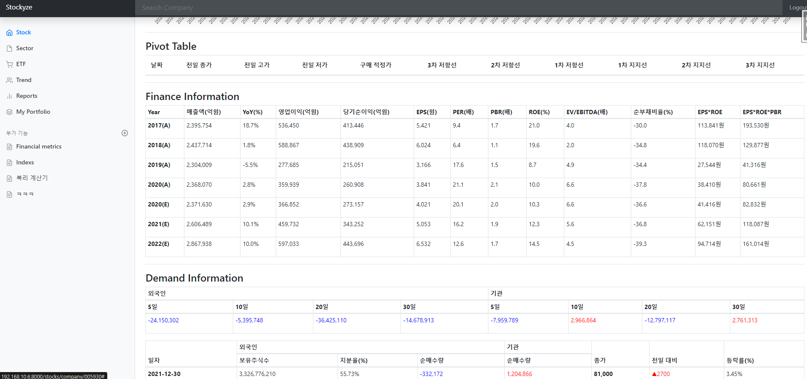
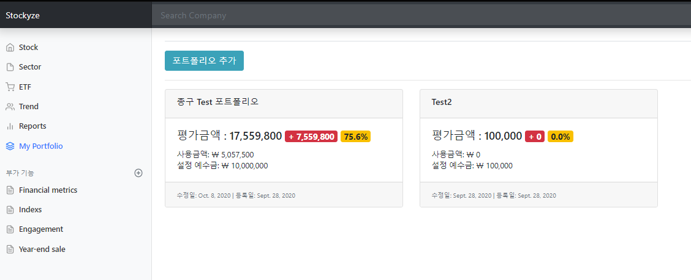
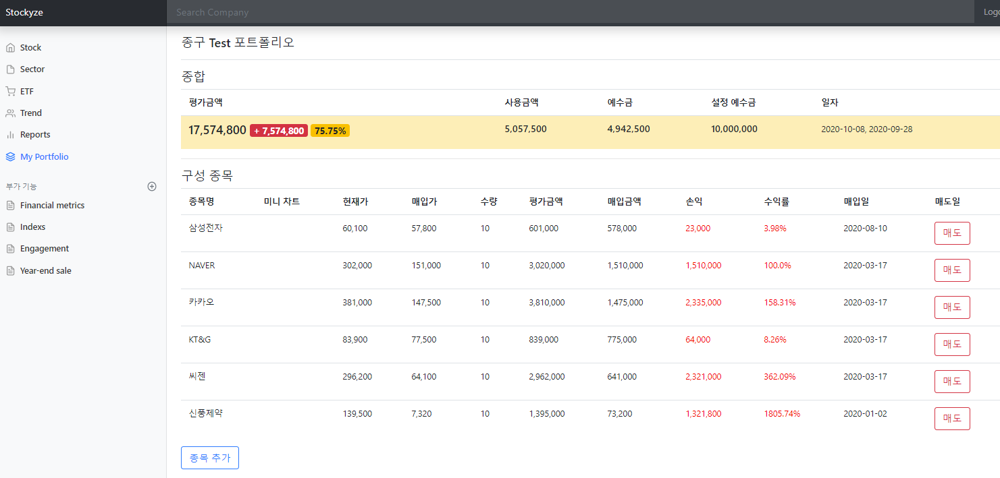
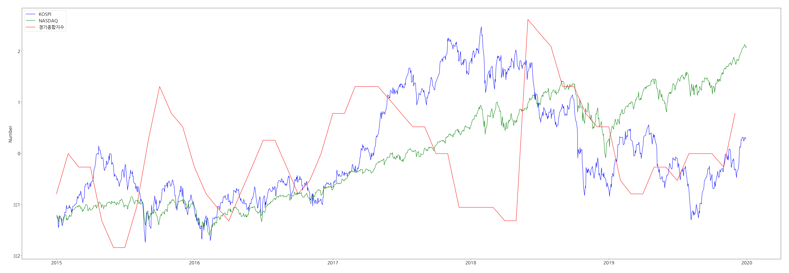
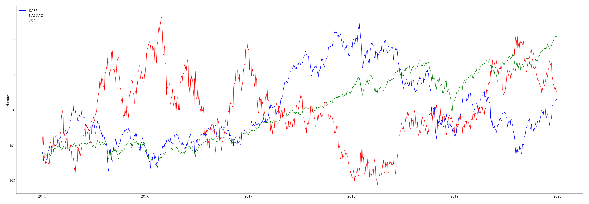
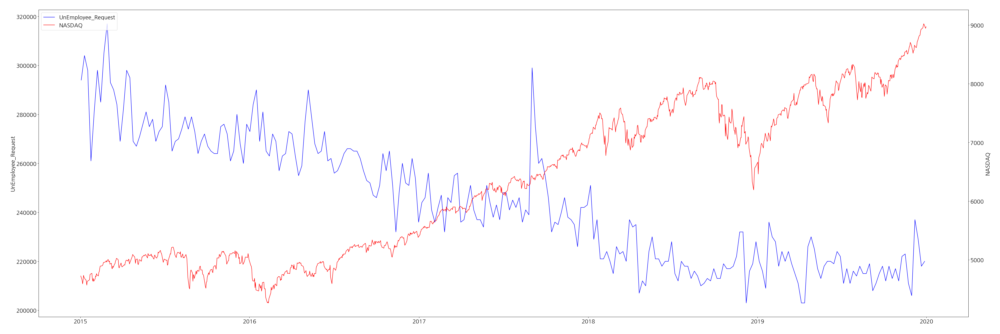
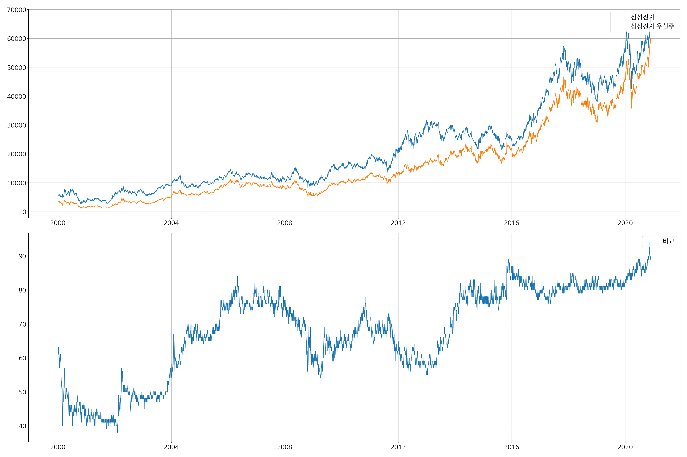
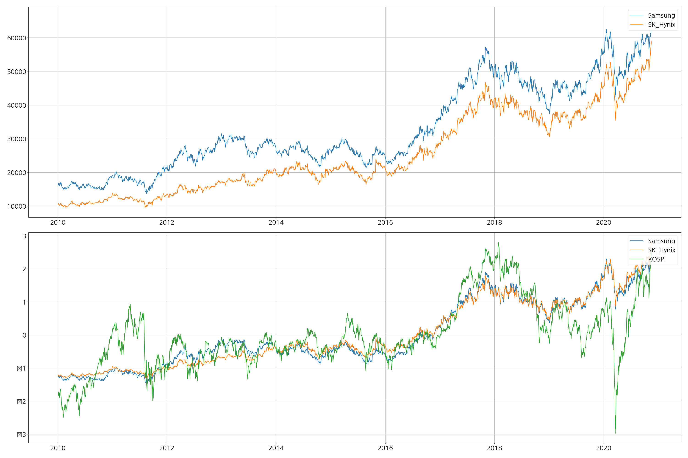

# django_study

```
Docer
- MariaDB
- MongoDB

Python 3.8
Django 3.0
```

#### Stock




#### Sector


#### ETF


#### Trend


#### Portfolio



#### Index


### Analyze 1


### Analyze 2


### Analyze 3


### Analyze 4


### Analyze 5

